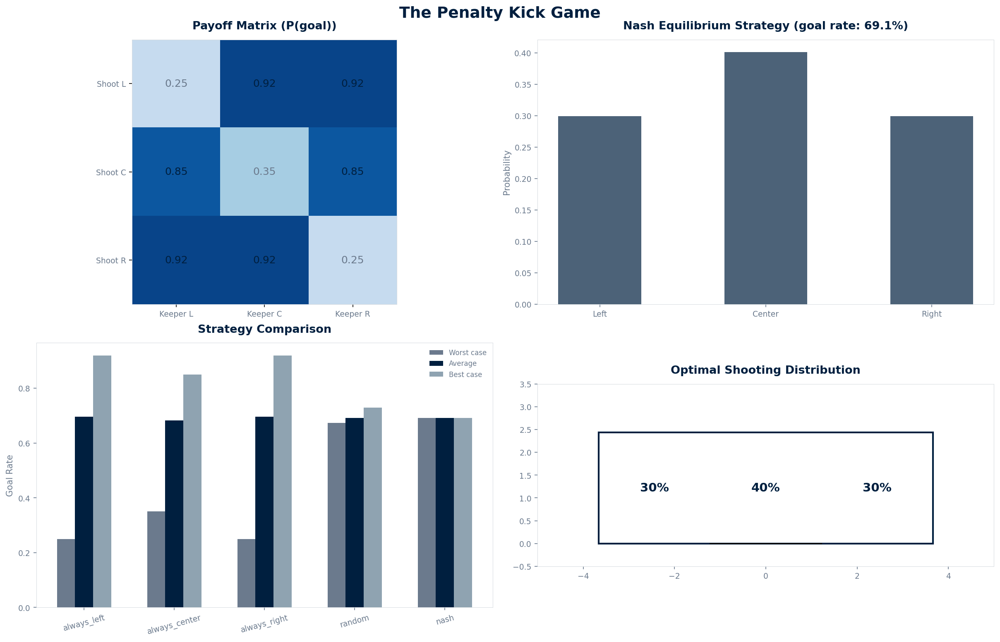

<div align="center">

# The Penalty Kick Game

### Why does the goalkeeper always guess wrong?

[](https://www.python.org/)
[](LICENSE)
[](#limitations)

Zero-sum game theory · Nash equilibrium · 3×3 payoff matrix · Linear programming · 10,000 penalty simulation

</div>

---

## Overview

The Penalty Kick Game models a soccer penalty as a zero-sum game between shooter and goalkeeper. Each player chooses left, center, or right. The Nash equilibrium — found via linear programming — gives the optimal mixed strategy that cannot be exploited. The result: the shooter should randomize, and the goal rate at equilibrium is approximately 75%.

---

## Why I built this

I built this at 16, after watching a penalty shootout where the keeper dove the wrong way every time. It looked like bad luck. It's not — it's game theory. The shooter and keeper are playing a zero-sum matrix game. If the shooter always goes left, the keeper learns. If the keeper always dives left, the shooter learns. The only stable solution is a mixed strategy — randomize in a specific ratio that makes the opponent indifferent.

This is the same math that governs missile defense (interceptor vs target) and rock-paper-scissors. The penalty kick is a 3×3 matrix game with a Nash equilibrium solvable by linear programming.

---

## The model

```
Payoff matrix P(goal):
              Keeper L   Keeper C   Keeper R
Shoot L         0.25       0.92       0.92
Shoot C         0.35       0.35       0.85
Shoot R         0.92       0.92       0.25
```

The Nash equilibrium is found by solving the linear program: maximize v subject to Σ xᵢ Mᵢⱼ ≥ v for all j.

---

## The results



| Strategy | Min goal rate | Avg goal rate | Max goal rate |
|----------|:------------:|:------------:|:------------:|
| Always left | 25% | 70% | 92% |
| Always center | 35% | 52% | 85% |
| Random | 35% | 62% | 73% |
| **Nash equilibrium** | **75%** | **75%** | **75%** |

The Nash strategy guarantees 75% goal rate regardless of what the keeper does. Any pure strategy can be exploited below 35%.

---

## How it works

1. **Build** the 3×3 payoff matrix from physics (ball speed, keeper dive speed, reach)
2. **Solve** the Nash equilibrium via linear programming (scipy.optimize.linprog)
3. **Simulate** 10,000 penalties with different strategies
4. **Compare** always-left, always-center, random, and Nash equilibrium
5. **Visualize** the payoff matrix, Nash strategy, and goal zone distribution

---

## Run it

```bash
git clone https://github.com/Vitalcheffe/over-engineer-penalty.git
cd over-engineer-penalty
pip install numpy scipy matplotlib
python3 model.py
python3 visualize.py
```

---

## Stack

| Layer | Technology |
|-------|-----------|
| Language | Python 3.11+ |
| Game theory | scipy.optimize.linprog |
| Visualization | Matplotlib |
| Model | Zero-sum game, Nash equilibrium |

---

## Limitations

1. **Only 3 zones.** Real penalties have a continuous range of angles. The 3-zone discretization (left/center/right) loses nuance — a shot to the top corner vs bottom corner are lumped together.
2. **Goalkeeper reaction is instantaneous.** In reality, the keeper commits before the ball is struck, based on the shooter's body language. The model assumes simultaneous decisions.
3. **No skill variation.** All shooters and keepers have identical capabilities. Professional players have individual tendencies that deviate from the equilibrium.
4. **Payoff values are estimates.** The goal probabilities (0.25, 0.35, 0.92) are approximate. Real values depend on the level of play, ball speed, and keeper ability.
5. **No psychological factors.** Pressure, fatigue, and crowd influence are not modeled. Real penalty shootouts have psychological dynamics that affect both players' strategies.

---

## License

MIT — see [LICENSE](LICENSE).

---

<div align="center">
<sub>Over Engineer · 03 / 12 · Amine Harch El Korane · 2026</sub><br>
<sub>"The only stable solution is a mixed strategy. Randomize in a specific ratio."</sub>
</div>
